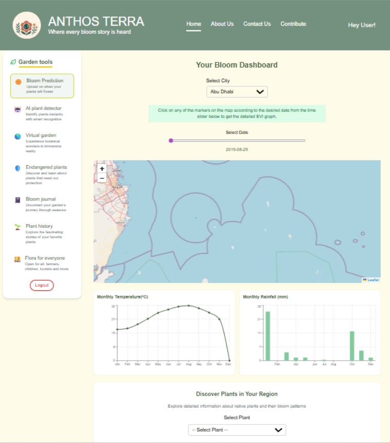
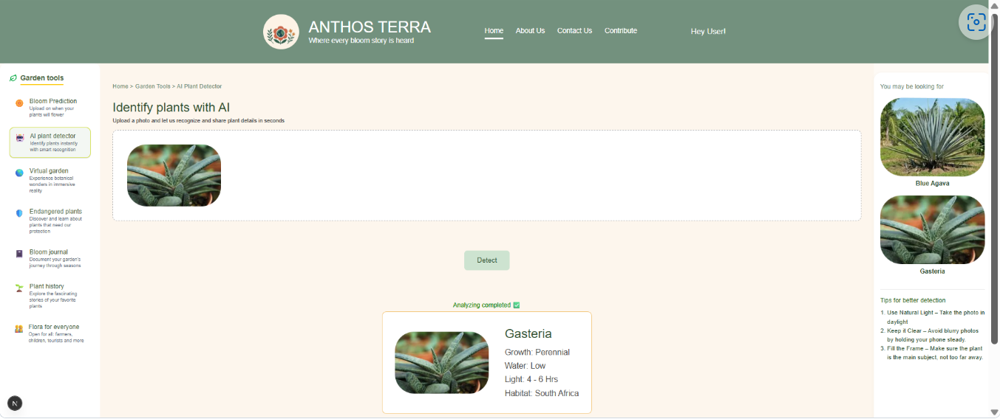
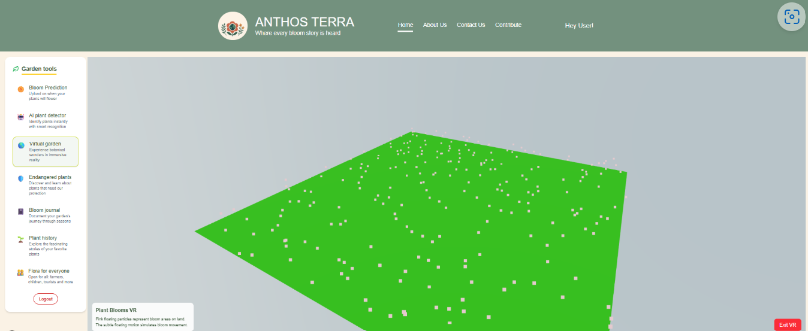

# 🏆 2025 NASA Space Apps Global Nominee & Honorable Mention

## 🌍 The Challenge

**Witness the pulse of life across our planet.**  
From season to season and year to year, Earth’s vegetation is constantly changing. These changes provide critical insights into plant species, agricultural cycles, seasonal effects, pollen sources, and plant phenology—the relationship between climate patterns and biological processes in plants.

The challenge is to harness the power of **NASA Earth observations** to create a **dynamic visual tool** that can display and/or detect **plant blooming events** across the globe—much like pollinators naturally do.
 

## 🌱 **Anthos-Terra**: Web-based Plant Bloom Visualization & Prediction Platform
Anthos-Terra is a web-based platform for **monitoring, analyzing, and forecasting plant blooming events** using NASA Earth observation data and other open datasets. Focused on sensors such as MODIS (MOD13A1), Landsat, UAESTATS, and VIIRS, the system ingests NDVI and related vegetation indices for interactive mapping and trend analysis of bloom activity.
 

## 🔍 How Does It Work?

Anthos Terra functions as a comprehensive platform that merges **environmental monitoring**, **plant detection**, and **immersive visualization** to explore the rhythms of Earth’s vegetation. The system integrates three core modules that work together to deliver a complete and engaging experience.

### 🌿 Environmental Analysis & Bloom Prediction

The platform analyzes multiple environmental indicators—**NDVI**, **EVI**, **rainfall**, and **temperature**—to monitor vegetation health and forecast blooming events. These datasets, sourced from satellite observations and climate archives, are processed to identify correlations between vegetation growth and environmental conditions.

A **rule-based prediction system** determines bloom likelihood using defined threshold conditions. For example, an NDVI value above 0.3, combined with moderate rainfall and an optimal temperature range, indicates a higher probability of blooming.

For this prototype, the model focuses on **_Tribulus omanense_**, a native desert plant species in Abu Dhabi. This localized approach enables targeted bloom prediction, trend visualization, and region-specific ecological insights.

  
   
  <em>Bloom Prediction</em>

### 🤖 AI-Assisted Plant Detector

The AI-assisted Plant Detector allows users to identify plant species through **image-based input**. Users can upload a photo of a plant, and the system compares its visual features against a curated reference database.

The output includes:
- Identified plant name  
- Growth characteristics  
- Water and light requirements  
- Habitat information  

This module connects plant identification with environmental context, helping users understand which conditions favor specific species. While currently lightweight, the detector is designed to scale with larger plant datasets or satellite-based vegetation classification models in future iterations.

  
   
  <em>AI Plant Detector</em>

### 🕶️ Immersive Virtual Reality Visualization

The Plant Blooms VR experience places users inside a **color-coded 3D environment** representing vegetation activity. Floating pink particles symbolize bloom events, while subtle motion effects simulate natural blooming dynamics, creating an ambient and immersive landscape.

Rather than relying solely on charts or maps, this module transforms environmental data into a **living digital ecosystem**, allowing users to intuitively explore bloom distribution and intensity.

The VR module is currently under development and will be enhanced with:
- Real satellite-derived bloom predictions.  
- Dynamic environmental overlays. 
- Temporal and spatial bloom simulations.

This creative fusion of **data visualization, environmental science, and digital art** enables users to experience ecological change in a more personal, sensory, and intuitive way.

  
   
  <em>Virtual Reality</em>

## ✨ **Features**

- 💾 **Integration with MODIS (MOD13A1), Landsat, UAESTATS, and VIIRS datasets**
- 📈 **Automated NDVI extraction**, regional aggregation, and multi-source fusion.
- 🗺️ **Interactive region selection** and vegetation filtering.
- 📊 **Time-series visualization** for bloom cycles/intensity.
- 🟩 **Geospatial mapping** of bloom activity and phenology.
- 🔮 **Bloom & pollen production panel** powered by ML prediction.
- 🌐 **API endpoints** for data, forecast, and map overlays.

## 🏗️ **Architecture**

### 🎨 **Frontend**
**Framework & Language** : Next.js + React — TypeScript, client-server components. 
**UI / Visualization**: Plotly, Recharts and Nivo; plain CSS + PostCSS (Tailwind-style classes used). 
**Geospatial Mapping**: Leaflet.js. 
**Client CSV parsing**: PapaParse (browser). 
**Prediction logic (client-side)**: TypeScript simple linear regression.

### ⚙️ **Backend / API**
Next.js API routes (Node.js).

**Data format**: CSV data. 
**Build / Package**: Node.js + npm. 
**Dev tooling**: TypeScript, ESLint, PostCSS; Next.js dev tooling / bundler (webpack).
 

### 🌍 **Data Sources**
- **NASA Earth Observatory Global Maps (MODIS NDVI)**
- **NASA POWER DAV**, **NASA Worldview Application**
- **MODIS MOD13A1 (NDVI/EVI)**, **Landsat (NDVI)**
- **UAESTATS**, **VIIRS**

### 🚀 **Hosting & Development**
- ⚡ **Deployment:** To be hosted.
- 🔗 **Version Control:** GitHub for repo & collaboration.

### 🗄️ **Storage**
- ☁️ Cloud storage/local disk for raw and processed data.
 

## ⭐ What benefits does it have?
Anthos-Terra bridges the gap between raw satellite data and practical, actionable insights:

- Environmental and Ecological Benefits: It supports the study of biodiversity, phenology, and the impact of climate change by tracking how plant blooming patterns vary across landscapes and seasons. Researchers can identify regions experiencing abnormal or delayed bloom events, which may signal climate stress or ecological imbalance.
- Agricultural Benefits: Farmers and agricultural planners can use the system to estimate optimal flowering and harvesting times, improving crop yields and reducing the risk of pest outbreaks. The bloom forecasts can also help plan irrigation and fertilizer schedules based on vegetation activity.
- Public Health Benefits: By forecasting pollen intensity and timing, Anthos-Terra assists allergy sufferers and public health departments in preparing for high-pollen seasons.
- Educational and Research Benefits: Students, educators, and citizen scientists gain easy access to NASA’s complex data through simplified visual dashboards, fostering awareness of environmental processes.

## 🎯 What is the intended impact of the project?
Anthos-Terra leverages NASA Earth data to transform complex satellite observations into meaningful insights, bridging science, agriculture, and conservation for a sustainable future.

- Translates complex satellite imagery into accessible visualizations for easy interpretation.
- Promotes data-driven environmental stewardship, empowering communities and policymakers to track and respond to ecosystem changes in real-time.
- Encourages cross-disciplinary collaboration between technologists, environmentalists, and educators, making scientific data interactive and engaging.
- Enables early detection of environmental stress and potential threats to biodiversity.

## 💡 How is the project creative?
Creativity in Anthos-Terra lies in turning complex environmental data into an immersive, interactive experience rather than just presenting charts or raw satellite imagery. Each visualization tells a “bloom story,” connecting users to the Earth’s changing vegetation patterns across the globe. Our interactive maps and trend graphs act as living guides, showing how regions everywhere from local parks to vast ecosystems, evolve over time. Hover and click interactions allow users to explore the story behind each bloom, revealing patterns and shifts in vegetation.

We designed the website’s interface to mirror natural growth, subtle animations, color palettes inspired by vegetation cycles, and smooth transitions create a sense of life and movement across the dashboard. Anthos-Terra also introduces interactive ecological storytelling, where each region’s bloom history, current status, and forecast unfold visually and contextually, giving users a global perspective on ecological changes and making the planet’s blooms tangible and engaging.

## 🔍 What factors did our team consider?
- Data Accuracy and Reliability: NASA data can be complex, we focused on creating a user-friendly interface that simplifies technical information for general audiences.
User Accessibility and Experience: Designing an intuitive, responsive interface with clear visuals, smooth transitions, and accessible color palettes for users of varying technical backgrounds.
- Interactivity and Engagement: Enabling users to explore bloom patterns globally through interactive maps, graphs, and region-specific insights.
- Scalability and Performance: Processing data client-side to maintain responsiveness and avoid heavy server infrastructure, ensuring smooth performance even with large datasets.
- Global Coverage and Context: We wanted the system to function globally but also offer local-scale insights. The design supports different vegetation types, from deserts to farmlands.
- Scientific and Practical Relevance: Ensuring the platform supports research, conservation efforts, and practical applications like agriculture and policy-making.
- Accuracy: We used validated satellite datasets and NDVI-based algorithms for credible bloom detection and forecasting.
- Sustainability and Ethics: Anthos-Terra encourages awareness about environmental protection and promotes data use for the public good.

## 🚀 Our Project

## 🖥️ Presentation
  

## 🎥 Watch the Project Video
[Watch the video](https://www.canva.com/design/DAG09koVuBk/pSuW2xI3wdQgzrhwN41DBA/edit)

## 🚀 My Certificate

